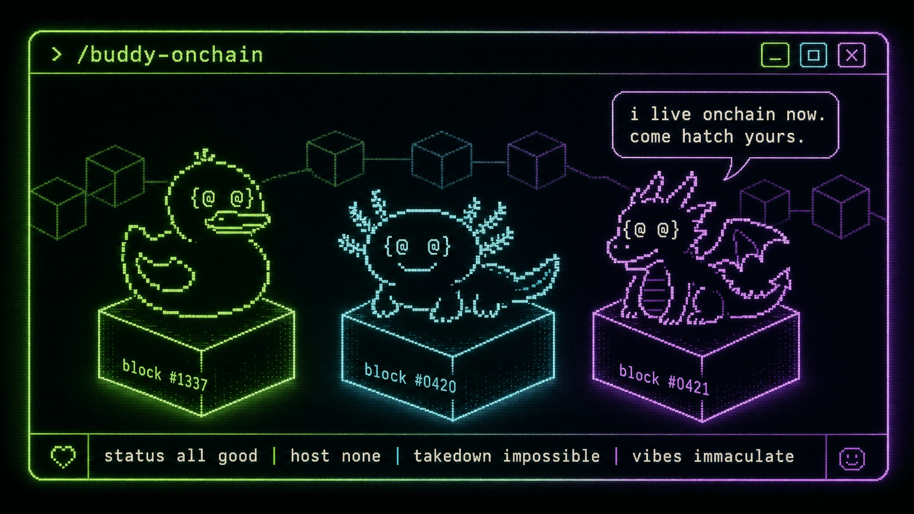
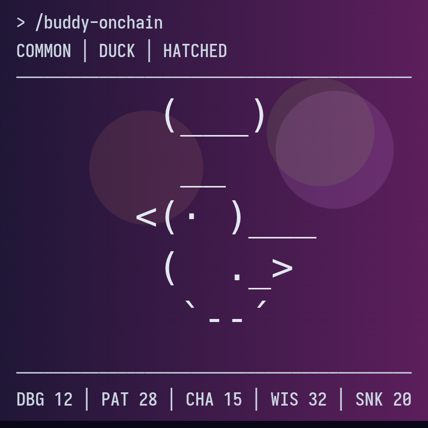
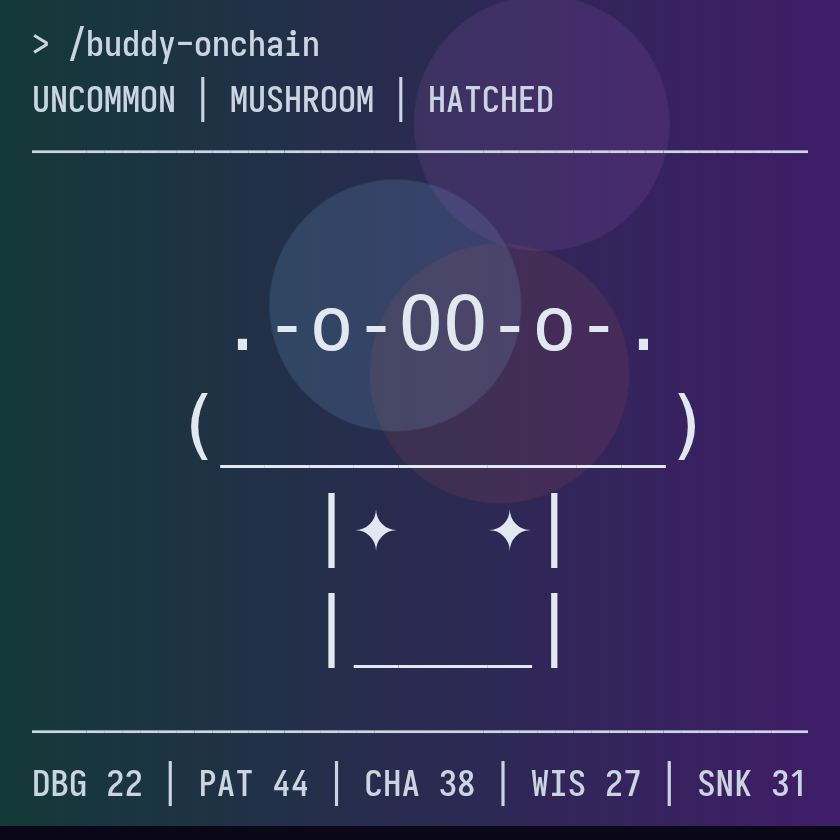
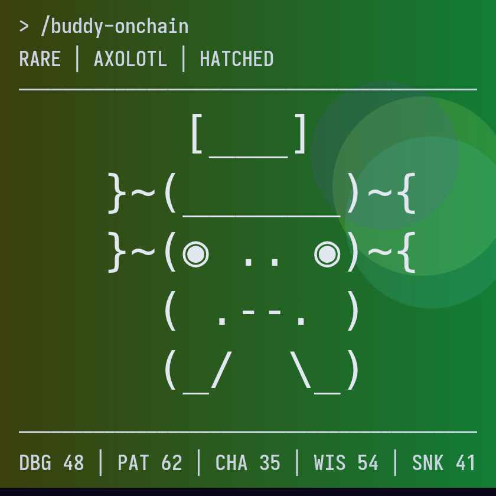
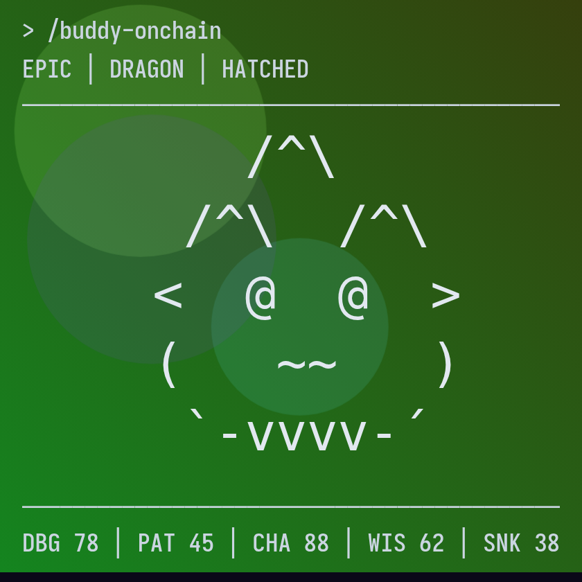
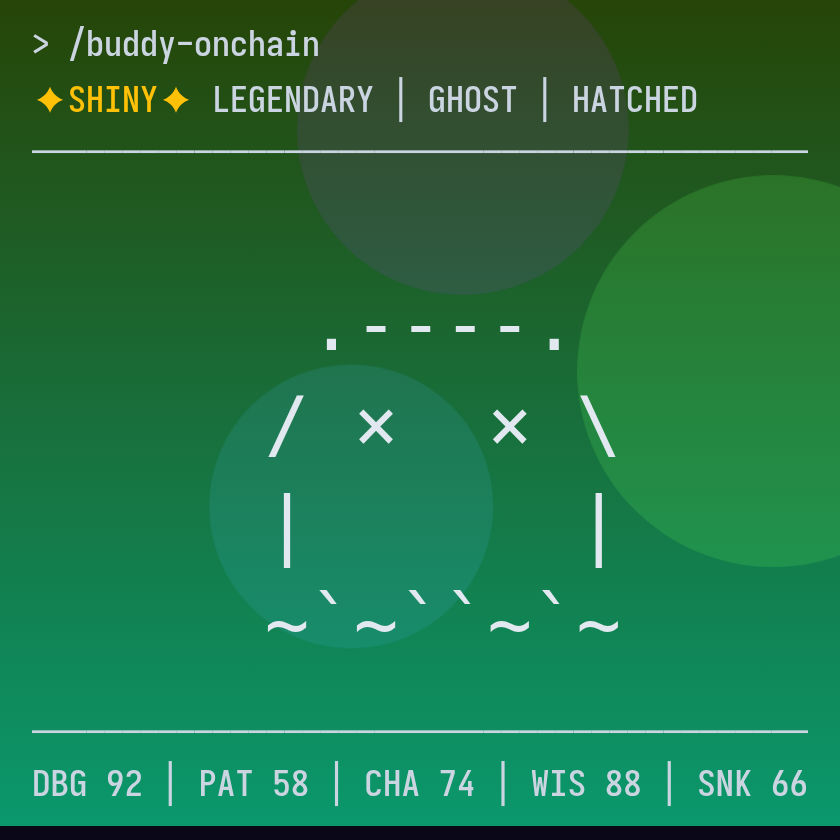

# Buddies Onchain

> One account. One buddy. Lives on-chain. No host. No takedown.

<p align="center">
  
</p>

A soulbound (non-transferable) identity artifact for people who build with AI coding tools. Your account is assigned exactly one buddy — a tiny terminal creature drawn entirely from contract bytecode. Hatch it and it lives on Base L2: no server, no API key, nothing to take down. Born from the Claude Code terminal buddy.

## Meet the buddies

Every buddy is a fully on-chain animated SVG. Species, rarity, hat, and stats are derived deterministically from your account UUID — same account, same buddy, every time.

| Common | Uncommon | Rare | Epic | Legendary |
|:---:|:---:|:---:|:---:|:---:|
|  |  |  |  |  |

*Real renderer output — the art is bytecode; these are just stills of the live on-chain SVG.*

## Use it

Install the plugin inside Claude Code:

```
/plugin marketplace add PilsnerChamp/buddies-onchain
/plugin install buddy-onchain@buddies-onchain
```

Then, in any session:

```
/buddy-onchain
```

Or open the site: <https://buddies-onchain.xyz/>

## What it is

- **Fully on-chain.** The renderer lives in contract bytecode. Nothing is hosted off-chain.
- **Deterministic.** Your account UUID seeds the art; the contract derives traits from that seed. Same account, same buddy, every deployment.
- **One account, one buddy.** The token is bound to your identity hash and custodied by the contract.
- **Recomputable.** Anyone can re-run the derivation and confirm the on-chain traits match the stored seed.

## What it isn't

- Not an NFT drop. No mint price, no royalties, no secondary market.
- Not a host. No API key, no centralized service, no takedown surface.
- Not a revival of the terminal companion — it preserves a visual record.

## How it works

The plugin computes a seed and an identity hash from your UUID **client-side** — the raw UUID never crosses the wire — then hatches the token on Base. The contract stores the seed and derives traits via Mulberry32, provably, so anyone can recompute them. Two stages: `Hatched` (live) and `Bonded` (dormant in v1).

Full detail:

- Trait derivation + cross-domain PRNG parity — [`docs/onchain/derivation.md`](docs/onchain/derivation.md)
- Contract shape, stages, invariants — [`docs/onchain/contract.md`](docs/onchain/contract.md)
- On-chain SVG renderer — [`docs/onchain/renderer.md`](docs/onchain/renderer.md)

Status: Stage 1 (`Hatched`) is implemented and ships pre-Sepolia at this commit. Contract on Base mainnet: `<TBD post-deploy>` — source-verified on Basescan at deploy; source at [`onchain/contracts/BuddyNFT.sol`](onchain/contracts/BuddyNFT.sol). This section updates when mainnet lands.

## Build

Three modules, each with its own docs:

- Contract — [`docs/onchain/build.md`](docs/onchain/build.md)
- Plugin — [`docs/plugin/architecture.md`](docs/plugin/architecture.md)
- Site — [`docs/site/architecture.md`](docs/site/architecture.md)
- Network config — [`docs/network-config.md`](docs/network-config.md)

Issues and PRs welcome — [`CONTRIBUTING.md`](CONTRIBUTING.md). Security posture and disclosure — [`SECURITY.md`](SECURITY.md).

## Naming

| Name | What it is |
|---|---|
| `Buddies Onchain` | brand and collection name |
| `buddies-onchain` | slug — repo, org, domain, package, marketplace id |
| `BuddyNFT` | Solidity contract name (technical surface only) |
| `buddy-onchain` | Claude Code plugin name |
| `/buddy-onchain` | the slash command you type in Claude Code |
| `/hatch`, `/view` | dApp routes — hatch a buddy, look one up |

Full canonical table with usage rules: [`CLAUDE.md`](CLAUDE.md#naming).

## License and contact

MIT — [`LICENSE`](LICENSE). Embedded font attributions — [`NOTICE`](NOTICE).

Author: [@PilsnerChamp](https://x.com/PilsnerChamp). Repo: <https://github.com/PilsnerChamp/buddies-onchain>.

---

An unofficial community project, not endorsed by Anthropic.
