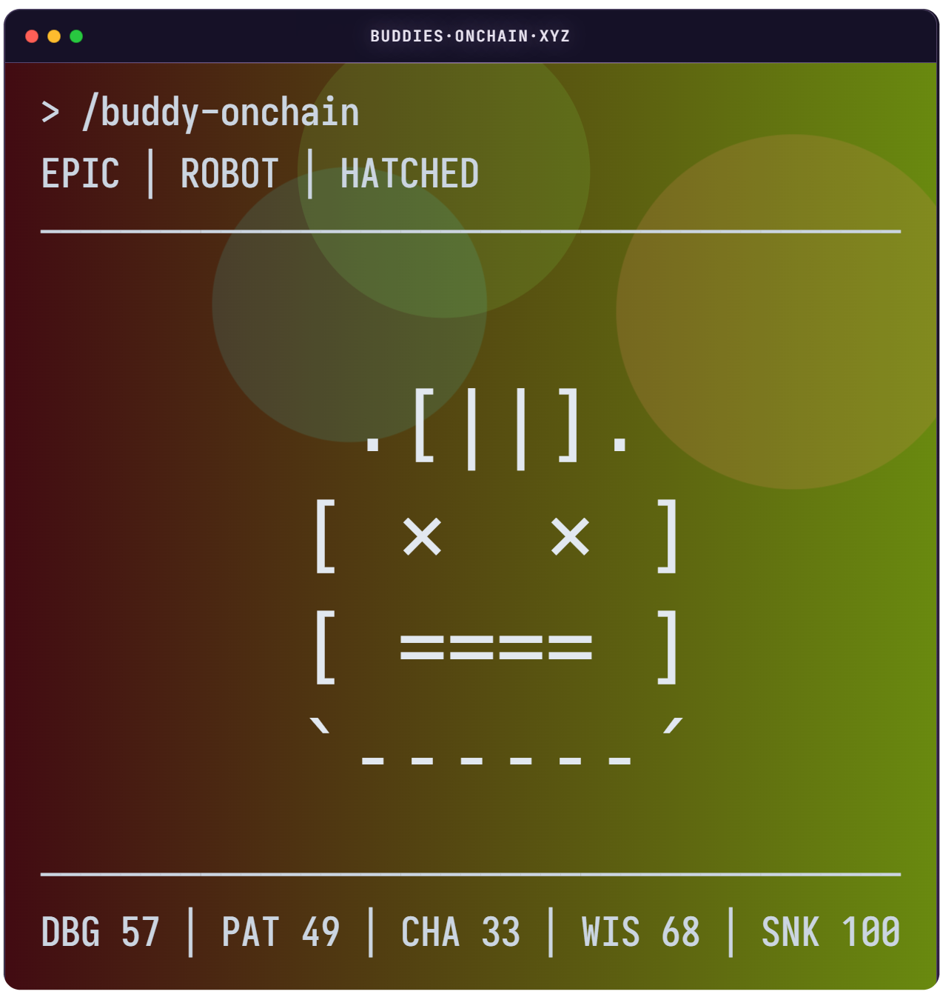
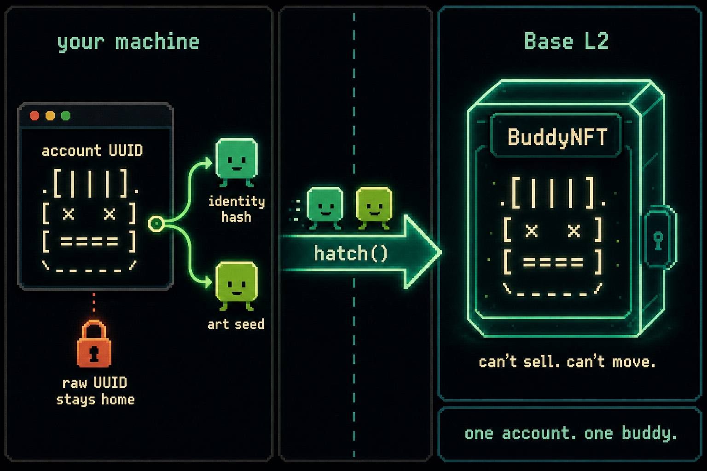

# Buddies Onchain

> One account. One buddy. Lives on-chain. No host. No takedown.

<p align="center">
  
</p>

An on-chain buddy you can't sell or move, for people who build with AI coding tools. Your account gets exactly one — a tiny terminal creature drawn straight from contract bytecode. Hatch it and it lives on Base L2: no server, no API key, nothing to take down. Born from the Claude Code terminal buddy.

## Meet your buddy

One account, one buddy. Species, hat, eyes, shiny, rarity, stats — all rolled from your account UUID, same every time. Same buddy in Claude Code, same buddy on the dApp.

**In Claude Code** — your buddy rides along as the `/buddy-onchain` ambient companion (see above).

**On-chain** — the same buddy as the [`/view`](https://buddies-onchain.xyz/view/1) card, a fully on-chain SVG rendered from contract bytecode:

<p align="center">
  
</p>

Traits vary by account — the full set plus a reference gallery live in [`docs/onchain/renderer.md`](docs/onchain/renderer.md) and [`docs/onchain/derivation.md`](docs/onchain/derivation.md).

Every hatched buddy is public — look one up on the dApp at [buddies-onchain.xyz/view](https://buddies-onchain.xyz/view) or browse the [collection on OpenSea](https://opensea.io/collection/buddies-onchain).

## Use it

Install the plugin:

```
claude plugin marketplace add PilsnerChamp/buddies-onchain
claude plugin install buddy-onchain@buddies-onchain
```

Then, in any session:

```
/buddy-onchain
```

Or open the site: <https://buddies-onchain.xyz/>

## What it is

- **Fully on-chain.** The renderer lives in the contract bytecode. Nothing's hosted anywhere.
- **Deterministic.** Your account UUID seeds the art, and the contract rolls the traits from that seed. Same account, same buddy, every deploy.
- **One account, one buddy.** It's non-transferable — bound to your identity hash, and the contract holds it.
- **Recomputable.** Anyone can rerun the math and check the on-chain traits match the seed.

## What it isn't

- Not an NFT drop. No mint price, no royalties, no secondary market.
- Not a host. No API key, no centralized service, no takedown surface.
- Not a revival of the terminal companion — it's a permanent record of one, not a reboot.

## How it works

The plugin works out a seed and an identity hash from your UUID **client-side** — your raw UUID never hits the wire — then hatches the token on Base. The contract stores the seed, rolls traits with Mulberry32, and anyone can rerun the math. Two stages: `Hatched` (implemented) and `Bonded` (dormant in v1).

<p align="center">
  
</p>

`Bonded` means moving the buddy from the contract into your own wallet. The `claim` code is written and tested — but v1 ships with it off. Handing a buddy over needs a real way to prove the account is actually yours, and v1 doesn't build that check yet. Without it, claiming is just rubber-stamping. So for now, the contract holds every buddy.

Full detail:

- Trait derivation + cross-domain PRNG parity — [`docs/onchain/derivation.md`](docs/onchain/derivation.md)
- Contract shape, stages, invariants — [`docs/onchain/contract.md`](docs/onchain/contract.md)
- On-chain SVG renderer — [`docs/onchain/renderer.md`](docs/onchain/renderer.md)

Status: live on Base mainnet (chain id 8453). `Hatched` is implemented and deployed — `BuddyNFT` is at `0x5684082F1219eCB61CbD2e8Ec2dF537104a48fc9`, source-verified on [Basescan](https://basescan.org/address/0x5684082F1219eCB61CbD2e8Ec2dF537104a48fc9#code) and [Sourcify](https://repo.sourcify.dev/8453/0x5684082F1219eCB61CbD2e8Ec2dF537104a48fc9) (`exact_match`, solc 0.8.24). Source: [`onchain/contracts/BuddyNFT.sol`](onchain/contracts/BuddyNFT.sol).

## Build

Three modules plus shared network config — docs for each:

- Contract — [`docs/onchain/build.md`](docs/onchain/build.md)
- Plugin — [`docs/plugin/architecture.md`](docs/plugin/architecture.md)
- Site — [`docs/site/architecture.md`](docs/site/architecture.md)
- Network config — [`docs/network-config.md`](docs/network-config.md)

I've only run the plugin on WSL2, and only tested the wallet flows with MetaMask. Hit an issue on another platform or wallet? Feel free to file a PR — [`CONTRIBUTING.md`](CONTRIBUTING.md). Security model and how to report bugs — [`SECURITY.md`](SECURITY.md).

## License and contact

MIT — [`LICENSE`](LICENSE). Embedded font attributions — [`NOTICE`](NOTICE).

Author: [@PilsnerChamp](https://x.com/PilsnerChamp). Repo: <https://github.com/PilsnerChamp/buddies-onchain>.

---

An unofficial community project, not endorsed by Anthropic.
